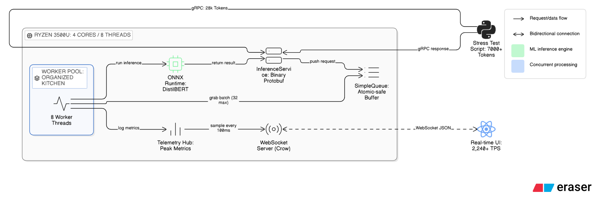
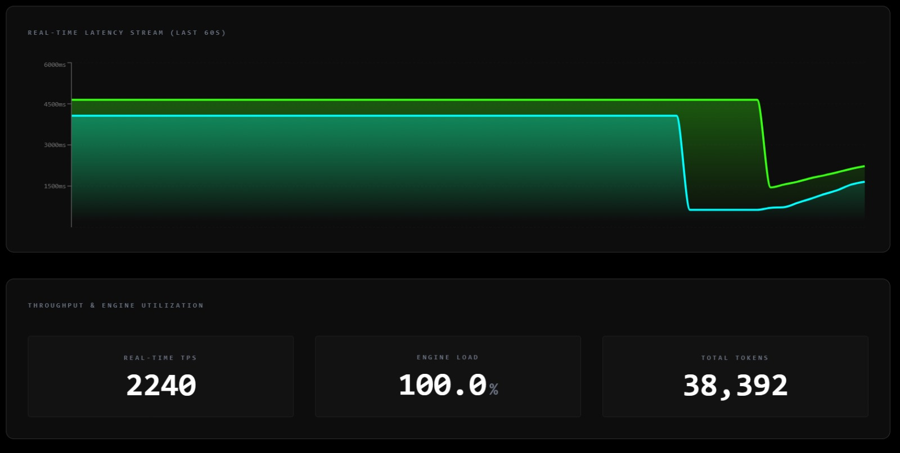
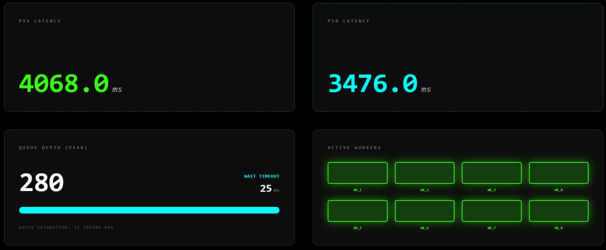
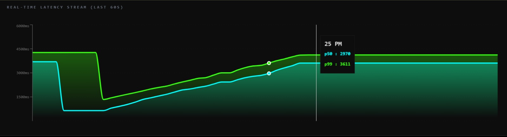
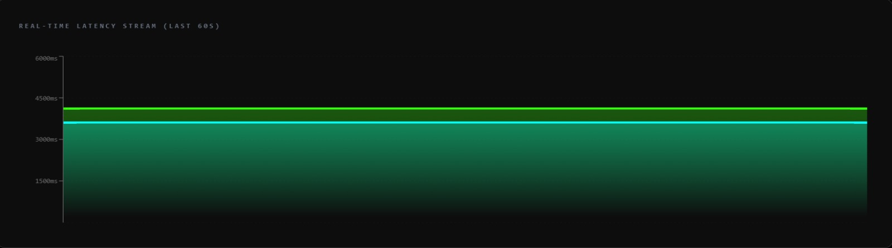

**Inference-Server-CPP**

**A High-Performance AI Inference Engine built with C++20, gRPC, and ONNX Runtime.**

**The Challenge**

Can you run high-throughput AI inference at scale on a 2019 consumer laptop? This project squeezes **2,240 Tokens Per Second** out of an AMD Ryzen 3500U (4C/8T) by focusing on low-level system design and resource maximization rather than raw hardware power.

**Architecture Overview**

The system is designed as a multi-layered engine to bypass the overhead typically found in Python-based AI stacks (GIL, PyObject conversions, etc.):

*   **Communication Layer (gRPC/Protobuf):** Uses binary serialization to eliminate the CPU overhead of parsing heavy JSON strings.
    
*   **Orchestration Layer (Lock-Free Thread Pool):** A fixed pool of 8 worker threads synchronized via condition variables to ensure zero-busy-waiting and 100% hardware saturation.
    
*   **Inference Layer (ONNX Runtime + INT8):** Native C++ integration with ONNX Runtime using INT8 quantization to keep the model resident in RAM and leverage SIMD instructions.

    

**Key Technical Methods**

**1\. Lock-Free Telemetry (CAS Loops)**

To track real-time metrics without the bottleneck of mutex contention, the engine uses hardware-level atomic instructions. We track peak values across time windows using **Compare-And-Swap (CAS)** logic. This ensures that even high-speed bursts are captured without slowing down the inference workers.

**2\. Dynamic Batching Strategy**

The engine balances throughput and latency by grouping requests into batches of **32 tokens** with a **25ms "latency ceiling."** This allows the CPU to perform vectorized math while ensuring no single request waits indefinitely under low load.

**3\. Preventing Oversubscription**

Most AI libraries spawn internal threads by default. This server forces single-thread execution per session, ensuring the master Thread Pool maintains total control over CPU cycles and avoids expensive context switching.

**Performance Benchmarks**

_Tested on: Ryzen 5 3500U, 8GB DDR4 (5.92GB usable), No GPU._
| Metric           | Value                                  |
|------------------|----------------------------------------|
| Peak Throughput  | ~2,240 Tokens/Sec                      |
| CPU Utilization  | 100.0% (Stable & Pinned)               |
| Memory Footprint | ~67MB (INT8 Quantized Model)           |
| Tail Latency (P99) | ~4068ms (Under 7k token burst)       |
**metrics**

~2,240 tokens/sec  
100% CPU utilization  
No SSD paging  

All 8 logical cores pinned, queue handling load without issues.

Latency stays controlled even during ramp-up.

Flat latency under sustained load.

**Getting Started**

**Prerequisites**

*   CMake (3.15+)
    
*   vcpkg (for gRPC and Protobuf)
    
*   ONNX Runtime C++ Libraries
    

**Build Commands**

1.  mkdir build && cd build
    
2.  cmake .. -DCMAKE\_TOOLCHAIN\_FILE=\[path\_to\_vcpkg\]/scripts/buildsystems/vcpkg.cmake
    
3.  cmake --build . --config Release
    

**Running the Server**

.\\Release\\server\_engine.exe 

**Detailed Deep-Dive**

I wrote a full technical breakdown of the engineering challenges, including the "Ghost Metrics" telemetry problem and hardware-level optimizations, on Dev.to:

**Read the full article here:** [https://dev.to/wricheek84/squeezing-2240-tps-out-of-a-2019-laptop-building-a-c-inference-engine-33bm]